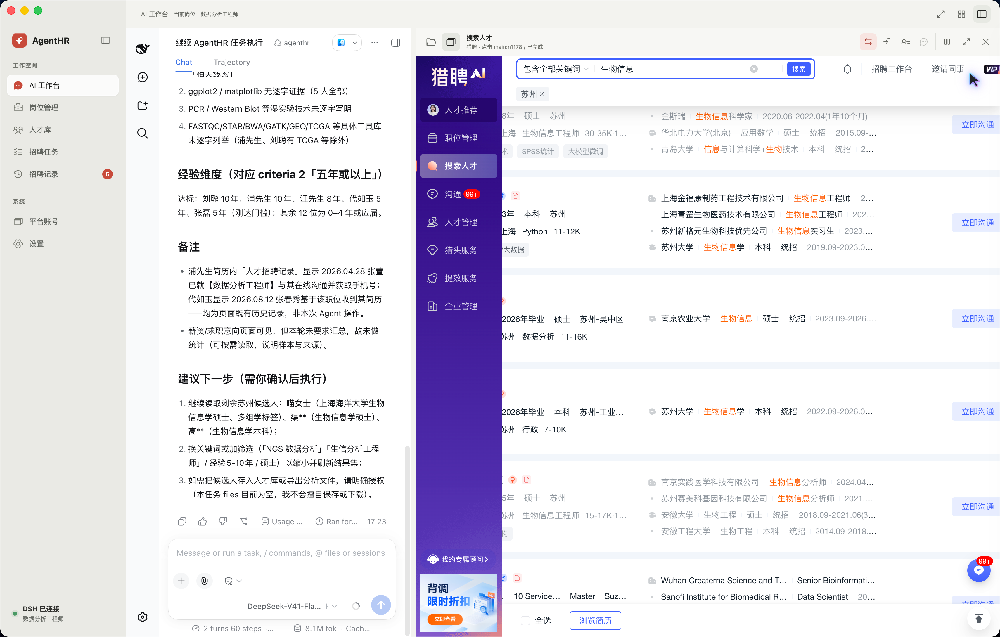
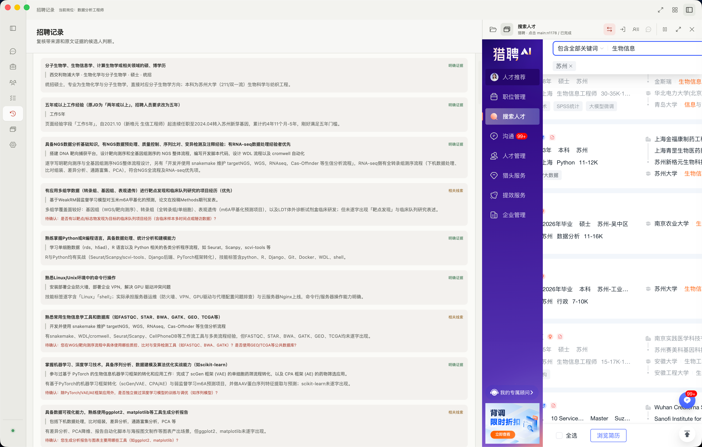
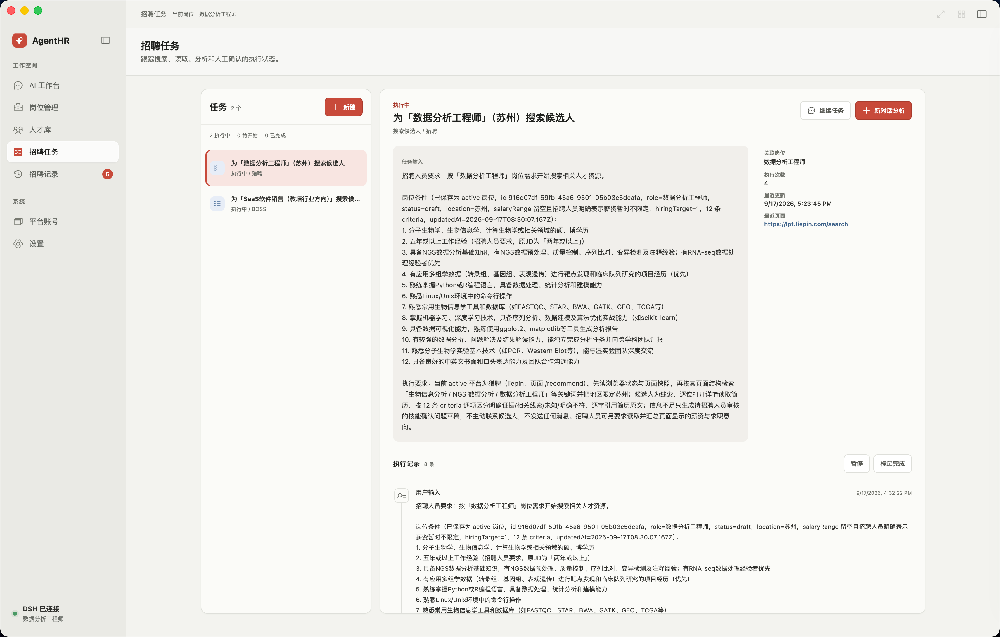

# AgentHR

项目仓库：[github.com/auenger/HRAgent](https://github.com/auenger/HRAgent)

独立 Electron 招聘工作台。左侧是岗位、人才、任务、技能和审计导航，中间完整嵌入 DeepSeek Harness（DSH）Agent 对话，右侧按需展开招聘浏览器或懒加载本地文件树。Agent 可根据自然语言保存岗位、操作招聘页面、读取候选人详情、维护人才库、生成有证据的分析草稿，并把成功任务沉淀为可审核的招聘技能。浏览器动作统一通过受控 CDP 输入执行；页面上的光晕指针只负责展示，并通过结构化动作回执与真实事件结果区分。

当前真实页面适配状态：**猎聘搜索页的搜索、结果读取和简历详情处理已基本可用；BOSS 搜索页仍在调试，不能视为稳定支持。** 两个平台的页面结构都可能变化，关键操作仍需人工复核。

## 界面预览

### AI 工作台与猎聘搜索



### 候选人证据化分析记录



### 招聘任务明细与执行记录



产品方向、架构和阶段验收见 [技术栈与实现方案.md](./技术栈与实现方案.md)。

## 本地启动

需要 Node.js `^22.19.0` 或 `>=24`、pnpm 11。项目固定依赖 DSH `0.1.5-rc.2`（npm `next` 标签）；AgentHR 运行时使用已发布的 npm 包，不依赖本机 DSH 源码目录。默认用 Electron 自带的 Node 模式启动 DSH：

```sh
pnpm install
pnpm dev
```

仅在开发时需要切换 DSH 或 Node 版本，才设置 `AGENTHR_DSH_CLI`、`AGENTHR_NODE_BIN`。见 [.env.example](./.env.example)；应用不会自动读取 `.env`。依赖安装采用 pnpm 的 hoisted 布局，以便 Electron Builder 收集 DSH 的运行时依赖。

```sh
pnpm typecheck
pnpm test
pnpm build
pnpm package:dir
pnpm verify:package
pnpm smoke:host
pnpm smoke:host:restart
pnpm smoke:host:package
pnpm smoke:agent-tools
pnpm smoke:browser-use
pnpm smoke:cdp
pnpm smoke:gui:package
```

## 当前实现

- `src/main/recruitment-browser.ts`：Electron `WebContentsView`，按站点隔离 `persist:` Session，限制主页面导航和弹窗；BOSS 与猎聘实例可同时保留，各自维持页面和登录状态，工具栏只切换当前活跃实例。DSH 的浏览器状态以 `active=true` 标明所有 Agent 工具的唯一操作目标。登录凭据由招聘网站页面及其 Session 管理，不写入 AgentHR 项目文件。
- `src/main/cdp-browser.ts`：通过 `webContents.debugger` 连接当前内置浏览器，无需远程调试端口。融合 DOM、完整层级 AX 树、增量 diff、浏览器点击事件标记和可见 frame；支持跨进程 iframe、开放 Shadow DOM、绑定实际节点的引用、真实鼠标/键盘输入、结构化等待条件和动作回执。所有点击路径统一使用 CDP 可信输入并核对事件是否到达目标；点击前检查遮挡、快照版本和授权。`pnpm smoke:cdp` 使用隔离本地页面验证城市级联、搜索、详情开关、sourceDigest、遮罩恢复、敏感动作拦截和跨域框架；不操作真实招聘账号。
- `src/main/platforms.ts`：站点地址和允许的域名。BOSS 推荐页与猎聘登录/推荐页地址参考 GoodHR 的平台配置；猎聘独立沟通页尚未确认，因此没有臆造 URL。
- `src/main/dsh-host.ts`、`src/main/dsh-profile.ts`：优先使用项目固定的 DSH 版本，通过受管的 Electron Node 子进程启动 DSH Web Host；AgentHR 招聘 preset 作为默认选项，同时保留 DSH 随附和用户自定义 preset。AgentHR preset 保留标准 `bash/read/write/edit/glob/grep/read_image` 能力，不额外限制 Shell 命令或工作目录文件读写，并叠加受控招聘工具。Host 从启动输出提取带认证 token 的 Web 入口地址；重启和应用退出都会有序关闭旧进程。
- `src/main/adapters/liepin.ts`、`src/main/adapters/boss.ts`：参考 goodhr5 的推荐页、卡片和简历详情选择器，读取至多 30 张当前可见卡片及唯一打开的简历。`candidate-action.ts` 只点击卡片的详情入口；`boss-greeting.ts` 仅在受控流程中重新精确匹配卡片并点击唯一的 BOSS 默认招呼按钮。页面动作会显示渐变阴影边框和光晕指针。猎聘搜索页已经过实际使用验证并基本可用；BOSS 搜索页仍在调试。
- `src/main/job-brief.ts`：招聘人员可创建、切换、编辑本机岗位条件，并为每个岗位列出最多 12 项逐项分析的技能条件；旧版单岗位 JSON 在首次读取时迁移为岗位列表，旧版长段要求保留原文并配一个可编辑的过渡条件。新建岗位尚未保存时没有当前岗位，Agent 不能按上一岗位继续分析。简历正文不会写入岗位配置文件。
- `src/main/bridge.ts`：仅监听 `127.0.0.1` 的随机端口，要求启动时生成的 Bearer Token；提供页面状态、AX/DOM 快照、候选人卡片、简历、岗位、任务和技能步骤回执，并允许操作快照中的受控控件、保存业务数据及执行经过授权的 BOSS 打招呼。不开放任意页面脚本或原始 CDP 命令。
- `src/main/assessments.ts`：使用 Electron 内置 Node 的 `node:sqlite` 保存待人工复核的分析卡片。每项技能条件对应独立的证据分类、原文、理由和问题草稿；提交时重新读取当前简历和岗位条件，核对两者的内容指纹、条件覆盖情况及简历证据原文。保存当前来源平台，完全相同的简历、岗位和分析内容仅在同一平台内去重；招聘人员可记录待复核、待技能确认或已复核状态，按当前岗位条件快照筛选。旧版单结论卡片仍可读取。不把完整简历正文写进分析库。该 SQLite API 在当前 Node 版本仍标为实验性。
- `src/main/recruitment-store.ts`：使用本地 SQLite 保存人才、岗位关联、招聘任务、任务条目、技能版本、技能来源、技能运行和步骤断点。完成任务后会从任务输入、对话结论和 DSH 操作证据提取技能草稿，按平台、任务类型和规范化步骤指纹去重合并；步骤失败保存证据并回退 Agent，连续三次运行失败自动标记 `needs_repair`。
- `src/main/workspace-store.ts`：管理 AgentHR 与 DSH 共用的工作目录。右侧目录树按层懒加载，点击文件时才读取预览内容；监听外部文件变化并刷新已展开目录。显示 `.agents`、`.vscode` 等工作配置，但过滤 `.git`、`node_modules`、`vendor`、虚拟环境和常见依赖缓存目录。
- `src/plugin/temporary-image.ts`：受控截图只进入零工具权限的一次性视觉子 Agent，主对话仅获得结构化结论。图片分析后立即物理删除规范化图片和请求附件；异常中断由 15 分钟 TTL 租约及周期垃圾回收清理。
- `src/plugin/index.ts`：向 DSH 注册 21 个受控招聘工具；连同 7 个标准 Shell/文件工具，AgentHR preset 当前共暴露 28 个工具。搜索和读页面无需先配置岗位；评估候选人时才需要岗位条件。技能化任务通过 `agenthr_record_skill_step` 保存步骤状态和证据。唯一外部联系动作是 BOSS 默认打招呼，必须满足明确授权、人工复核、岗位未变化、结论合格和候选人重新唯一匹配。
- `src/renderer`：左侧为 AgentHR 招聘业务导航，中间完整嵌入 DSH 工作台，右侧按需展开懒加载文件树或招聘浏览器；各栏支持收缩和拖拽调宽。文件树支持文件夹展开、名称/修改时间排序、外部变更自动刷新和手动刷新。招聘技能页展示通用、BOSS、猎聘分类、历史证据、运行统计、连续失败和任务步骤断点。

DSH `0.1.5-rc.2` 的部分间接依赖仍会被包管理器解析到旧版；`pnpm-workspace.yaml` 将已发现的 19 个包统一锁到同一版本。当前目录包关闭 ASAR：DSH 会在本机 profile 下建立依赖链接，链接到 ASAR 内文件时，普通 Node 模块解析无法找到这些包。以后若恢复 ASAR，需要参考 DSH Desktop 的包内模块解析和按需解包方案，并重新通过包内 Host 检查。

## 尚未完成的关键工作

1. 继续在 **Electron 内**验证 BOSS 搜索页、两站登录态恢复和页面结构变化。开发阶段不直接测试真实候选人沟通。
2. 基于用户反馈校正猎聘与 BOSS 的候选人卡片、简历详情、关闭按钮和招呼按钮选择器，继续实现按平台分离的完整简历字段适配器。当前提取结果是有上限的可见文本，不等于已验证的完整简历结构。GoodHR 的对应实现仅作为参考，不把其 Go/CloakBrowser 执行器引入运行时。
3. 继续完善人才身份合并和证据编辑流程。当前人才库已保存姓名、公司、职位、所在地、求职意向、薪资、来源平台和岗位关联，并支持显式人工合并；仍不能仅凭同名或简历更新自动认定为同一人。人工状态只表示处理进度，不表示技能已确认或已联系候选人。
4. 继续验证正式发行链路。当前 macOS 未签名目录包已包含 DSH CLI 和 AgentHR 插件；`verify:package` 检查包内依赖、插件导入、配置合成及 Electron 内置 SQLite，`smoke:host:package` 已从包内 Electron Node 启动 Host 并取得认证后的本地 Agent 页面。`smoke:gui:package` 在隔离的离线模式下验证了 App 主窗口、React 工作台和 preload 桥接。尚未验证 Windows 包、真实网站登录流程、签名和更新机制，因此不能视为正式发行包。

`smoke:host:restart` 已在隔离目录启动真实 DSH Host、完成两次认证页面访问，并验证 Host 有序重启。Host 重试只恢复 DSH 服务和 Agent 窗口入口；正在运行的 Agent 任务会中断。DSH 会话内容能否在真实招聘操作中按预期恢复，仍需招聘人员在实际使用流程里验证。

通用浏览器执行器通过 CDP 读取可见的站内 iframe（隐藏框架不进入快照），支持普通文本框、级联选择入口、复选框、标签页、候选人卡片、悬停和指定 frame 滚动。无角色但绑定点击事件的自绘元素也会被识别；`javascript:;` 与 `javascript:void(0)` 可作为同页交互入口。节点引用在插入无关 DOM 后保持稳定，目标移除、语义变化或导航后要求重读。发送消息、下载等继续交给用户授权流程。搜索页和推荐页均可作为当前工作页面；未经用户明确指定或同意，Agent 不得在 BOSS 与猎聘之间切换，也不得因详情识别失败离开当前搜索结果。CDP 不能保证识别全部自绘组件，真实站点与完整字段提取仍需验证。

## 招聘人员手动验证

1. 在左侧浏览器登录所需平台，打开“候选人”页；重启 App 后检查是否保持登录状态。
2. DSH 显示“已连接”后在右侧创建 Agent 会话。可以先说“查看当前页有什么”或“搜索 Java 工程师”，无需先创建岗位；快捷按钮只填入提示词，可编辑后发送。
3. 核对 Agent 是否在左侧搜索框输入、提交搜索并读取搜索结果；再请它打开其中一人的详情。核对渐变阴影边框与连续移动的光晕指针，以及是否只打开资料、不触发沟通。也可手动打开简历。
4. 请 Agent 读取简历并逐项分析；在“岗位与记录”核对来源平台、原文证据和“未知”判断。人工标记“已复核”后，只有没有未知或不符项的 BOSS 候选人才显示二次确认的“打招呼”入口。也可明确要求 Agent 联系当前符合条件的候选人；不要用真实候选人做开发验收。

> 请读取当前岗位和我已经打开的简历。逐项判断技能要求，引用简历原文；如果只写了“动物实验”而没明确写 tMCAO，不要判定为已掌握或明确不符。生成简短的技能确认问题草稿，并保存待人工复核的分析卡片。不要发送消息。

如页面结构不匹配，记录平台、页面入口、失败步骤和工作台错误文案即可；不要将账号密码或候选人完整简历贴进项目 issue 或日志。

招聘账号和密码不要放进源码、`.env`、测试快照或日志。当前原型不会在没有招聘人员明确授权的情况下发送候选人消息；受控动作只使用 BOSS 平台默认招呼语，每岗位每天最多 20 位，并记录去重与审计结果。

本地检查只使用模拟 DOM、桥接层模拟请求、模拟分析数据、插件工具到桥接和分析库的完整模拟链路、类型检查、构建，以及隔离临时目录里的 DSH Host 和 App GUI。`test` 还会创建真实 DSH Agent 会话并检查工具目录：AgentHR preset 当前提供 21 个招聘工具和 7 个标准 Shell/文件工具。自动化测试不会登录或操作真实招聘账号。猎聘搜索页已经过实际使用验证并基本可用；BOSS 搜索页仍在调试。DSH 会话本身可能记录 Agent 读到的简历内容；当前“不保存完整简历正文”仅指 AgentHR 的分析 SQLite 库。

## License

本项目采用 [MIT License](./LICENSE)。

维护者：yzw · [yzw@imcoders.net](mailto:yzw@imcoders.net)
