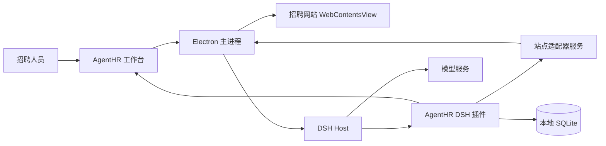

# AgentHR 技术栈与实现方案

> 方案草案｜2026-09-14。依据当前对 [DeepSeek Harness（DSH）](https://github.com/deepseek-ai/deepseek-harness)、[DSH Desktop](https://github.com/anywhere-labs/dsh-desktop) 和 [GoodHR](https://github.com/hhh0078/goodhr) 的代码与架构检查整理。招聘网站的实际兼容性尚未经过登录后的端到端验证。

当前项目初始化进度与运行命令见 [README.md](./README.md)。用户提供的 `tesla_style_fronted` 配色已用于桌面工作台；猎聘与 BOSS 企业端已加入浏览器平台列表、只读卡片适配器和“读取招聘人员已打开的简历详情”能力。工作台可创建、切换和编辑本机岗位条件，并列出逐项分析的技能要求；DSH 插件读取当前岗位、分析当前简历，并提交带岗位指纹与简历原文校验的逐项分析草稿。分析队列现支持按岗位条件快照筛选、相同内容去重及招聘人员标记复核状态，但尚无招聘网站的稳定候选人 ID。项目现固定依赖 DSH `0.1.5-rc.2`（npm `next` 发布候选版），同级 DSH 源码目录也已快进到远端最新 `master`；运行时仍使用 npm 发布包和只加载 AgentHR preset 的隔离配置。macOS 目录包已在隔离环境验证 CLI、插件、配置、认证后的 Host 本地页面，以及离线 App GUI / preload / 工作台；真实招聘页面仍由用户自行验证。以下阶段表仍按**最终验收标准**列出，不以页面能打开代替登录后流程验证。

## 1. 目标与结论

做一个独立的桌面招聘 App：在应用内打开招聘网站，由 DSH Agent 读取候选人资料、判断岗位匹配度、主动补问缺失信息、跟进薪资和求职意向，最后给用人部门生成带证据的候选人推荐。

**建议采用自有 Electron 桌面壳 + DSH 运行时 + AgentHR 插件 + 招聘网站适配器。** GoodHR 只作为页面操作和招聘流程的参考，不作为产品运行依赖。DSH Desktop 可参考其 Host 启动、桌面窗口和打包方式，但直接安装一个普通插件不足以让它控制新的 Electron 招聘网站窗口；其[公开插件服务](https://github.com/anywhere-labs/dsh-desktop/blob/d61b6f9/dsh-plugin-desktop/docs/plugin-services.md)没有开放原生 Electron API。若直接以 DSH Desktop 为基础，就需要修改其桌面壳并承担后续跟进成本。

Electron 内置 **Chromium 内核**，不等同于安装了完整 Google Chrome。它让登录态、浏览器窗口、Agent 和本地数据处于同一 App 内，但不会自动解决招聘网站页面适配、验证码或反自动化问题。

## 2. 技术栈

| 层次 | 建议技术 | 主要职责 |
| --- | --- | --- |
| 桌面宿主 | Electron、TypeScript、Node.js | App 生命周期、窗口、站点会话、系统能力、打包与更新 |
| 内嵌招聘浏览器 | Electron `WebContentsView`、独立 `persist:` Session | 展示 BOSS 直聘等站点，保存各账号登录态；与 App 自身 UI 隔离 |
| Agent 运行时 | 本地 DSH / Cordis 插件体系 | 模型调用、Agent 会话、工具调用、任务编排 |
| 招聘业务插件 | TypeScript、DSH `defineTool` / `ctx.tools.register` | 向 Agent 提供搜索、读简历、读对话、发消息、保存判断等业务工具 |
| 网站适配器 | TypeScript、Electron `webContents` / CDP；按站点封装 | 将页面读写转换为稳定的招聘业务操作；具体控制方式由原型验证决定 |
| 桌面工作台 | React + TypeScript（建议） | 岗位配置、候选人队列、证据与对话、待确认操作、推荐结果 |
| 本地存储 | SQLite | 岗位、候选人、证据、沟通状态、任务进度、发送去重与审计记录 |
| 构建发行 | Electron Builder（可参考 DSH Desktop） | macOS / Windows 安装包、DSH 运行时与原生依赖打包 |

选用 [`WebContentsView`](https://www.electronjs.org/docs/latest/api/web-contents-view) 来承载外部站点；Electron [不建议新项目使用 `<webview>` 标签](https://www.electronjs.org/docs/latest/api/webview-tag)。招聘网站使用[独立的持久 Session](https://www.electronjs.org/docs/latest/api/session)，不与 DSH 工作台共享 Cookie。页面操作可以通过 `webContents` 或其 [CDP 调试接口](https://www.electronjs.org/docs/latest/api/debugger)实现，但要先用真实站点验证 iframe、弹窗、登录和消息发送等路径，再确定最终封装。

## 3. 进程与模块边界

- **Electron 主进程**拥有招聘网站窗口和 Session。远程网页不直接接触 Node.js、DSH 工具或 SQLite；窗口、导航、弹窗和权限由主进程控制。远程内容采用 `nodeIntegration: false`、`contextIsolation: true`、`sandbox: true`，遵循 [Electron 安全建议](https://www.electronjs.org/docs/latest/tutorial/security)。
- **DSH Host**在桌面 App 内启动，沿用 DSH 的 Agent、模型、工具和会话能力。[DSH Desktop 架构](https://github.com/anywhere-labs/dsh-desktop/blob/d61b6f9/docs/architecture.md)已经证明这种宿主方式可行；AgentHR 自己拥有桌面原生桥接层。
- **AgentHR 插件**负责招聘任务状态、模型决策和工具定义，不直接管理 Electron 窗口。它通过内部受控服务请求页面操作。
- **站点适配器**只负责“如何在某招聘站点完成动作”，不决定候选人是否合适。当前已接入猎聘与 BOSS 的只读卡片和手动打开简历的文本提取原型；BOSS 的 iframe 层级参照 GoodHR5，两个站点的选择器均待用户在真实页面验证。
- **SQLite**保存可恢复的业务状态。DSH 会话记录可用于追溯推理过程，但不充当唯一的候选人数据库。

插件向 Agent 暴露的是 `searchCandidates`、`readResume`、`readConversation`、`sendMessage`、`saveAssessment` 等**业务工具**，而不是任意点击、执行 JavaScript 或读取 Cookie 的底层权限。发送工具需要校验平台、账号、候选人、会话最新状态和幂等键，防止串人或重复发送。

## 4. 核心招聘流程

以下是长期完整流程。**第一版只实现候选人信息的只读分析与技能确认问题草稿**；涉及实际沟通、薪资和求职意向的步骤留到后续阶段。

1. 招聘人员配置岗位：必要技能、可接受的相邻经验、薪资范围、地点、沟通语气和推荐标准。例如“熟悉 tMCAO 动物造模”，同时明确 MCAO、动物实验等描述是否仅能算相关线索。
2. 适配器按岗位检索并读取候选人资料。Agent 从简历中提取带原文出处的技能、项目、年限和缺失项，将证据标记为**明确写出、可合理推断、未知、明确不符**。
3. 对“熟悉动物实验，但未说明 tMCAO”的候选人，Agent 不直接判为合格或不合格，而是生成针对性问题：是否亲自操作 tMCAO、做过哪些环节、独立程度、模型成功率或相关项目经验。问题保持自然、简短，避免一次发送多轮问卷。
4. 读取回复并更新证据；继续确认期望薪资、到岗时间和岗位意向。岗位薪资上下限等确定性条件由配置规则判定，模糊表述与复杂经历交由模型解释，并保存其依据。
5. 形成推荐结论：匹配点、待确认点、薪资与意向、对话证据、推荐理由。信息不足则保留为“待跟进”，不虚构结论。

初期让招聘人员检查待发送消息和推荐结果；当站点操作、身份核对与去重稳定后，再按岗位和账号配置可自动发送的范围。Agent 可以自主决定**问什么、何时追问、是否推荐**，但实际发送仍经过固定的身份校验、频率控制和操作记录。

## 5. GoodHR 与 DSH Desktop 的参考范围

GoodHR 仓库中仍有本地执行器代码：其[新版架构文档](./goodhr/goodhr5/local-agent-go-new/docs/architecture.md)描述了 Go 任务层、TypeScript 浏览器 Worker、招聘平台适配器与 SQLite 的分层；[浏览器 Worker 设计](./goodhr/goodhr5/local-agent-go-new/docs/browser-worker-design.md)包含元素查找、点击、输入、滚动和验证思路。可参考其业务动作拆分、平台选择器管理、错误日志和去重方案。AgentHR 不沿用 GoodHR 的 Go 服务、云端控制台、CloakBrowser 或批量流程作为运行基础；如复制具体代码，应单独核对对应文件的许可及依赖。

DSH Desktop 提供了可参考的 Electron 启动 DSH Host、加载 Web UI、管理桌面窗口和发行包的实现。其现有 DSH 窗口会[限制外部页面导航](https://github.com/anywhere-labs/dsh-desktop/blob/d61b6f9/dsh-plugin-desktop/src/electron-shell-generation.ts)，普通插件也没有创建和控制原生招聘网站窗口的公开接口。因此建议**借鉴架构，自己持有招聘浏览器及桥接代码**，避免将产品能力绑定在 DSH Desktop 的内部接口上。当前 AgentHR 也参考其[有序关闭再重启的宿主边界](https://github.com/anywhere-labs/dsh-desktop/blob/master/dsh-plugin-desktop/README.md)，在 Host 失败时提供手动重试；不把任务续跑视为已验证。

## 6. 实施顺序与验收点

| 阶段 | 交付物 | 必须验证 |
| --- | --- | --- |
| 1. 浏览器可行性原型 | 最小 Electron App，内嵌 BOSS 与猎聘页面，独立持久 Session | 由招聘人员自己验证登录、重启后会话、候选人列表与简历页面；开发阶段不代替用户操作真实账号 |
| 2. DSH 集成 | App 启动 DSH Host，注册 AgentHR 插件，工作台能调用只读工具 | 站点窗口与 Agent 通信、工具返回结构、任务取消与重启恢复 |
| 3. 只读招聘分析 | 岗位配置、候选人状态、简历判断、tMCAO 技能确认问题草稿、分析卡片 | tMCAO 未写明场景不会被机械排除；每个判断可追溯到简历证据；不自动联系候选人 |
| 4. 后续沟通能力 | 在独立验证后再考虑技能追问、薪资与意向、可配置发送、去重、频率限制和人工接管 | 不串候选人、不重复发送、页面状态改变时停止并提示处理 |
| 5. 多平台与发行 | 新站点适配器、安装包与更新机制 | 不修改 Agent 决策层即可接入新站点；打包后的 DSH 与浏览器能力正常工作 |

**当前最大未知数是招聘网站在 Electron 内核中的实际兼容性。** 阶段 1 通过之前，不应把“可以登录、稳定读取和发送消息”写成已实现能力。其次需要验证 DSH Host 与 Electron 的 Node/原生依赖在正式安装包中的运行和更新方式。

## 7. 第一版范围

第一版处理真实招聘数据，因此采用**只读分析**：**搜索候选人 → 读简历 → 判断 tMCAO 证据 → 生成技能确认问题草稿 → 生成带证据的分析卡片**。不自动联系候选人，不追问薪资或求职意向，也不把未知技能写成已确认。小核酸、ASO、CNS 等岗位方向共用同一套“岗位条件 + 证据 + 问题草稿”机制，通过配置扩展，不在页面自动化中硬编码岗位词汇。薪资、意向及自动沟通属于后续阶段，须在真实站点验证和人工审核机制稳定后再开发。

当前原型的站内搜索与筛选由招聘人员在网站页面完成，Agent 只读当前可见卡片和手动打开的简历；自动检索尚未实现。BOSS 详情关闭后可能残留 iframe，因此读取前后均检查推荐页与简历 iframe 唯一可见，无法确定时停止读取。真实页面的有效性仍以招聘人员的手动验证为准。
